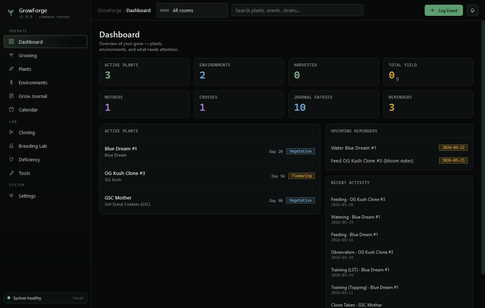
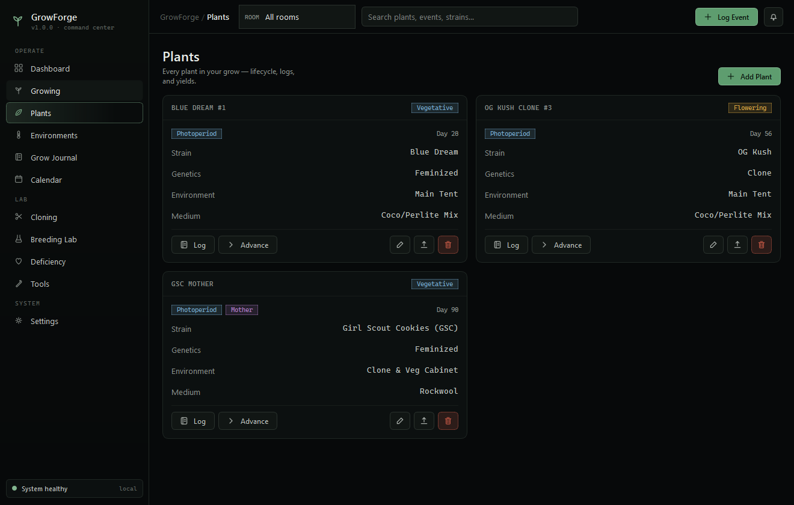
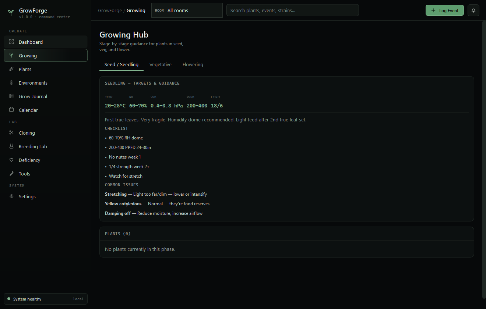
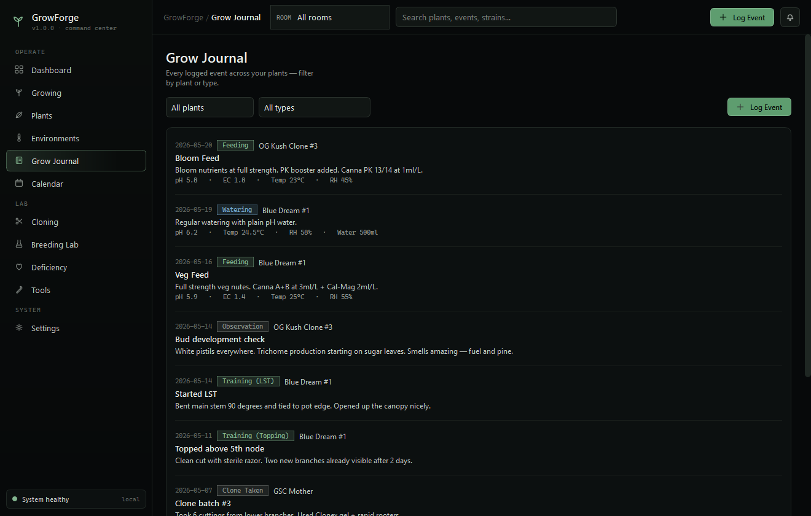
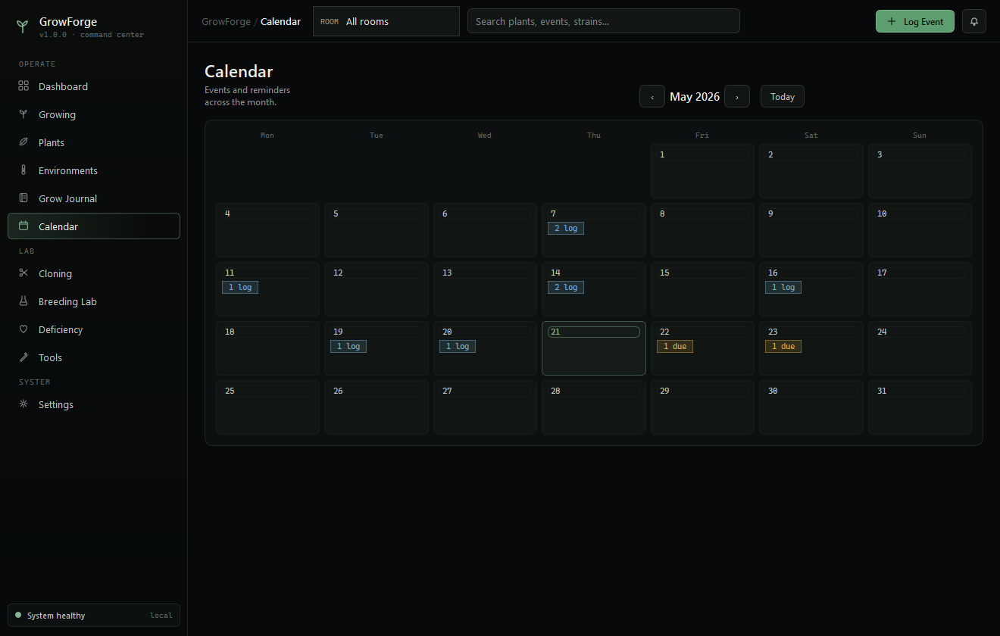
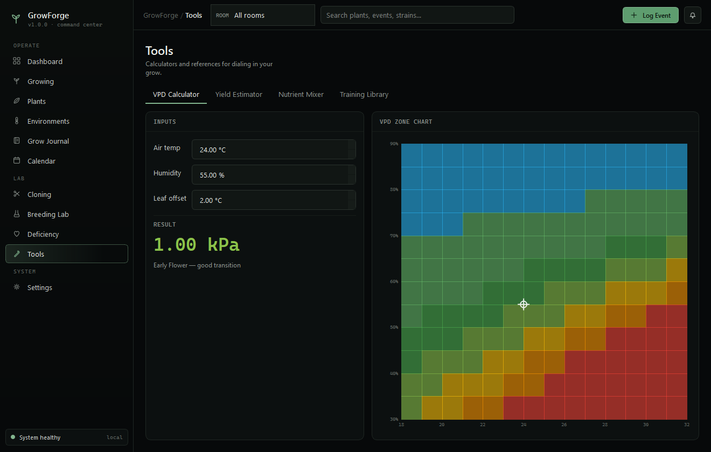
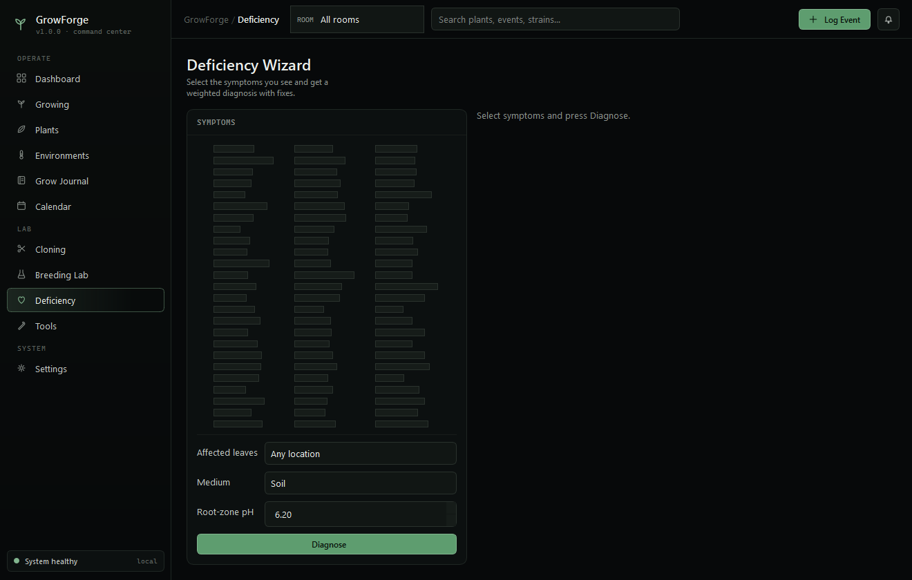
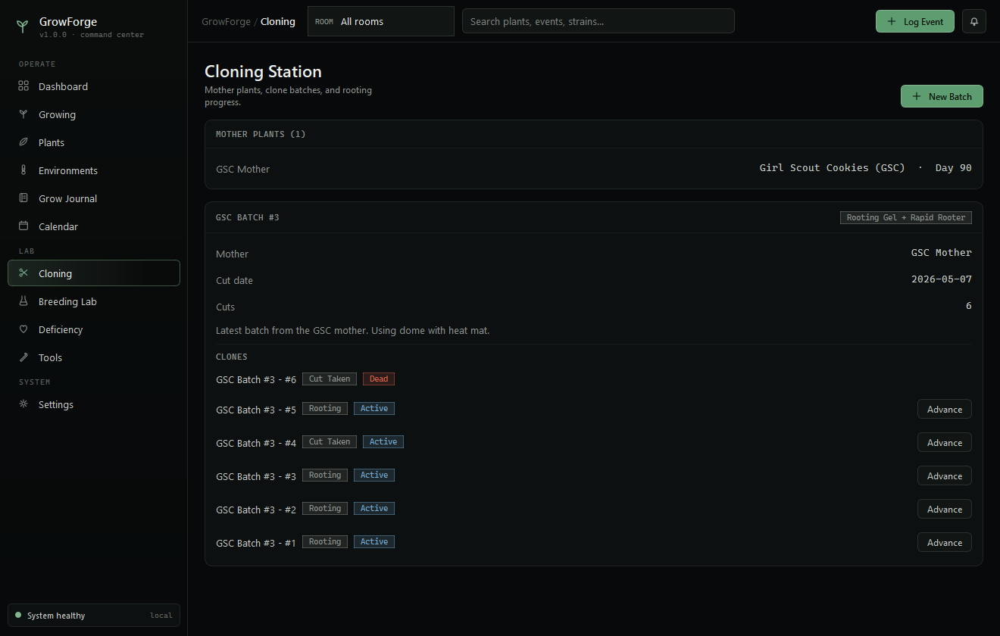
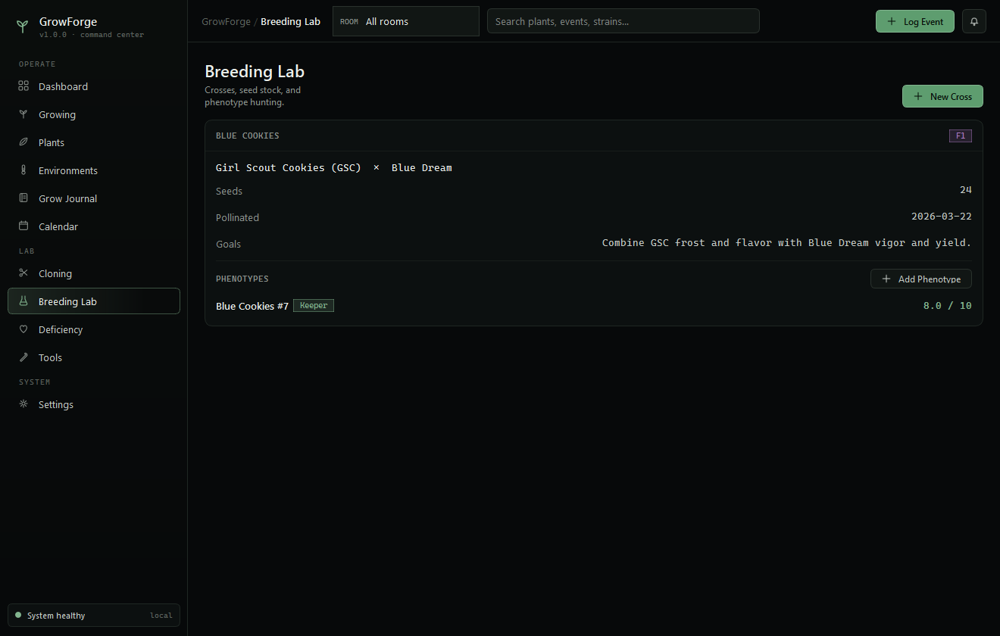

<div align="center">

# 🌿 GrowForge

### From Seed to Harvest, Clone to Cross — a local-first desktop grow assistant.


</div>

GrowForge is a 100% local, offline desktop application for tracking a cannabis grow
from end to end — plants and their full lifecycle, environments, a structured grow
journal, cloning, breeding and phenotype hunting, a deficiency-diagnosis wizard, and
a set of grow calculators. Every record lives in a local SQLite database on your
machine; nothing is ever uploaded, and no account or internet connection is required.

It is built in **C++17 with Qt 6 (Qt Widgets)** and wears a dense, dark
"command-center" interface.

<div align="center">



</div>

---

## Download

Grab the latest Windows build from the
**[Releases](https://github.com/MalloyTheDev/growforge/releases)** page:

- **Installer** — `GrowForge-<version>-setup.exe`: run it for a Start Menu shortcut and
  an uninstaller. Data is stored per-user in `%LOCALAPPDATA%\GrowForge`.
- **Portable ZIP** — `GrowForge-<version>-windows-x64.zip`: unzip and run `growforge.exe`,
  no installation. Keeps its data in the folder, so it runs from a USB drive too.

Both are self-contained — no separate Qt or runtime install needed. Prefer to build it
yourself? See **[Build & run](#build--run)**.

---

## Highlights

- **Local-first & private** — all data stays in a single SQLite file beside the app.
- **Full grow lifecycle** — eight stages from Germination to Harvested, with automatic
  stage-change logging and stage-appropriate reminders.
- **Built-in knowledge base** — a library of **2,300+ strains** plus stage guides,
  deficiency/symptom patterns, nutrient and pest references, and training techniques —
  all bundled and fully offline.
- **Real calculators** — a live VPD calculator with a color-coded zone chart, a yield
  estimator, and a nutrient mixer.
- **Professional reports** — export a formatted PDF grow report for any plant.
- **Fast, native, no telemetry** — a single compiled executable; charts are drawn
  directly with `QPainter` (no heavyweight charting dependency).

---

## Screenshots

| Plants | Growing Hub |
|:---:|:---:|
|  |  |
| **Grow Journal** | **Calendar** |
|  |  |
| **Tools — VPD Calculator** | **Deficiency Wizard** |
|  |  |
| **Cloning Station** | **Breeding Lab** |
|  |  |

---

## Features

| Screen | What it does |
|---|---|
| **Dashboard** | At-a-glance stat cards, active plants with stage badges and day counters, actionable reminders (overdue + upcoming, each with a *Done* button), and a recent-activity feed. |
| **Growing Hub** | Seed / Veg / Flower phases with stage-specific targets (temp, RH, VPD, PPFD, light schedule), checklists, and common-issue fixes drawn from the knowledge base. |
| **Plants** | Add/edit plants; advance through 8 lifecycle stages (auto-logging the change and creating reminders); log events; track yield; export a per-plant PDF report; archive without losing history. |
| **Environments** | Tents, cabinets, and rooms with light type/wattage, schedule, medium, and size. Deleting one safely unlinks its plants. |
| **Grow Journal** | Every logged event, filterable by plant, type, and free text, with pH / EC / PPM / temp / RH / VPD / water readings. |
| **Calendar** | Month grid with per-day event and reminder markers and quick navigation. |
| **Cloning Station** | Mother plants, clone batches, per-cutting rooting progress, and one-click promotion of a rooted clone into a tracked plant. |
| **Breeding Lab** | Crosses with parent linking, seed counts and generations, and phenotype scoring across 10 categories with an auto-calculated overall score. |
| **Deficiency Wizard** | Pick the symptoms you see and get a weighted, ranked diagnosis with fixes and pH-lockout context for your medium. |
| **Tools** | A VPD calculator with a live temperature/humidity zone chart, a yield estimator, a nutrient mixer, and a training-technique library. |
| **Settings** | Theme (dark/light), experience mode, units, reminder intervals, and CSV export of all events. |

---

## Architecture

GrowForge is a classic layered Qt Widgets application:

- **`app/`** — global configuration and the theme engine. The entire look is a single
  QSS stylesheet generated from a typed color palette, so dark/light themes and accent
  changes are data-driven.
- **`data/`** — the SQLite layer (`QtSql`) with WAL mode, foreign keys, generic CRUD
  guarded by table/column whitelisting and field-range validation, and a knowledge base
  loaded from an embedded JSON resource.
- **`core/`** — framework-agnostic logic: the VPD calculator (Tetens equation), a
  `QTimer`-based reminder engine, and PDF/CSV exporters.
- **`ui/`** — the `MainWindow` shell (sidebar + topbar + stacked pages), reusable
  widgets (cards, badges, metric cards, `QPainter` sparklines and VPD chart), data-entry
  dialogs, and the eleven screens.

**Stack:** C++17 · Qt 6 (Widgets, SQL, PrintSupport) · SQLite · CMake + Ninja.

---

## Build & run

You'll need **Qt 6** (Widgets, SQL, PrintSupport), **CMake 3.21+**, and a **C++17**
compiler. On Windows the MinGW kit bundled with Qt works out of the box.

```sh
cd growforge-qt
cmake -G Ninja -B build -S . -DCMAKE_BUILD_TYPE=Release \
  -DCMAKE_PREFIX_PATH="<path-to-Qt>/6.x/<kit>"
cmake --build build
```

On first launch the app creates its data folders and SQLite database next to the
executable and loads the strain library. A new install starts **empty** — your grow
is yours to fill in. If you'd like demo data to explore the features, use
**Settings → Data → Load sample data**. See
**[`growforge-qt/README.md`](growforge-qt/README.md)** for exact Windows/MinGW
commands, MSVC notes, and how to produce a self-contained bundle with `windeployqt`.

---

## Data & privacy

GrowForge is offline by design. All state — plants, events, photos paths, reminders,
breeding records, and settings — is stored in `growforge.db` (SQLite) next to the
executable, alongside `photos/`, `exports/`, and `backups/` folders. There is no
network code, no telemetry, and no account. Back up your grow by copying the database
file; export individual plant reports to PDF or all events to CSV from within the app.

---

## Repository layout

```
growforge-qt/        The Qt 6 / C++ application
  src/
    app/             Config (constants, palette) + Theme (QSS generation)
    data/            Models (row helpers), Database (Qt SQL), KnowledgeBase (JSON)
    core/            VpdCalculator, ReminderEngine, Exporter (PDF/CSV)
    ui/              MainWindow, Page/ScrollPage, Toast, Helpers
      widgets/       Icons, Card/Badge/MetricCard, Sparkline, VpdChart
      dialogs/       Plant / Event / Environment / CloneBatch / Breeding dialogs
      pages/         The eleven screens
  resources/         QSS theme, sample data, embedded knowledge base
  docs/              Screenshots
design/              The original UI design prototype the look is based on
```

---

## Data sources & credits

The bundled strain library (`growforge-qt/resources/knowledge.json`) is assembled from:

- **Cannabis strain dataset** (≈2,350 strains: type, effects, flavor, descriptions) —
  the widely-circulated Leafly-derived "Cannabis Strains" dataset.
- **[Kushy Cannabis Dataset](https://github.com/kushyapp/cannabis-dataset)** — used for
  canonical strain name casing. Licensed under the MIT License,
  © 2016–present, Kushy.
- **~50 hand-curated strains** with cultivation detail (breeder, flowering time, THC
  range, yield) maintained in this project; these take precedence on name conflicts.

The cultivation guidance (stage targets, symptom/deficiency patterns, nutrient and pest
references, training techniques) is original to GrowForge. Strain data is provided for
informational purposes only.

## License

Released under the [MIT License](LICENSE). © 2026 Brendan Malloy.
